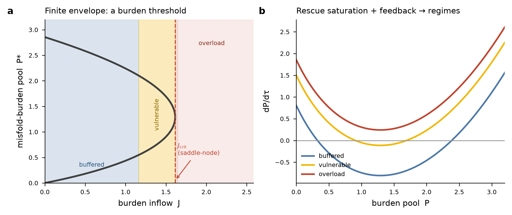
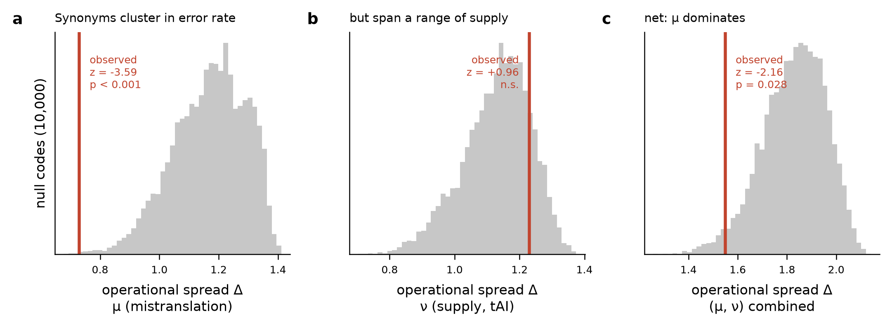
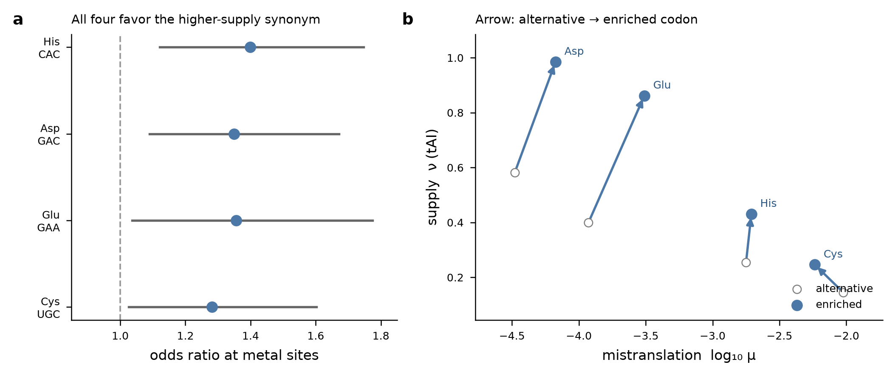
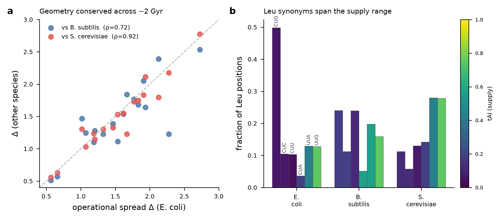
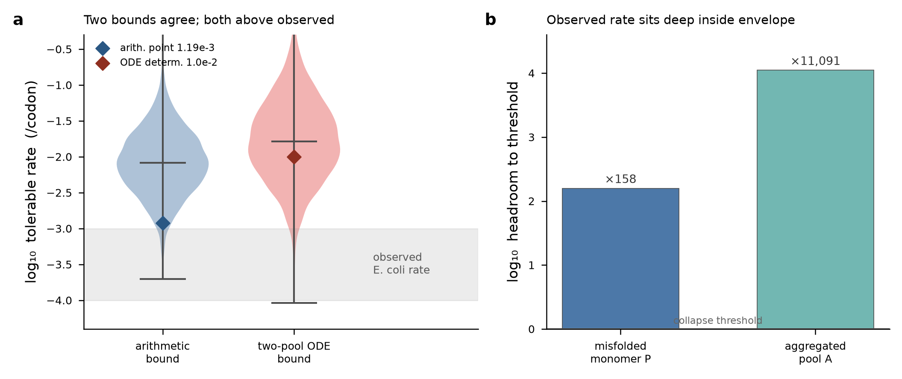

# A finite proteostasis envelope for translation: synonymous codons as state-dependent load allocation

Hannah E. Rebbeck, Janak Paudyal, and Boggavarapu Kiran

Department of Chemistry and Physics, McNeese State University, Lake Charles, LA 70609, USA

Corresponding author: kiran@mcneese.edu

**Classification:** Biological Sciences / Systems Biology / Molecular Evolution

**Keywords:** proteostasis | translation | synonymous codons | mistranslation | tRNA adaptation index | quality control

---

> **Draft status (2026-07-11).** Combined first draft fusing the burden-capacity
> theory (`proteostasis-paper/manuscript/MANUSCRIPT.md`) with the verified
> two-axis codon-deployment evidence (`codon-deployment/JME/MANUSCRIPT.md`). All
> quantitative codon results are taken from the **audited/verified** source
> (`codon-deployment/JME/VERIFICATION.md`), NOT from the stale root
> `manscuript-final.md`, whose N=17,166 and several odds ratios are not
> reproducible from data on disk. The synonymy-necessity / doublet-exclusion
> argument is deliberately excluded and cited out to the triplet-architecture
> paper. Target journal: MBE. Unresolved items flagged `VERIFY` inline. The P1
> two-pool ODE result is now included (Result 6): the ODE bound sits ~2× *above*
> the arithmetic bound with overlapping CIs (not below, as the stale
> `proteostasis-P1/README.md` states — see `B1_ODE_arithmetic_bound_resolution.md`).
> Authorship added (Rebbeck, Paudyal, Kiran; McNeese State). References complete
> and PubMed-verified (36 entries, PMIDs/DOIs). Remaining: confirm the companion
> triplet paper's author list; ref 12 (Martens & Hilser) pending venue; ref 1
> volume/pages and the `proteostasis-P1/README.md` in-place fix (read-only mount).

---

## Significance statement

Translation produces burden as well as product: as protein output rises, cells
must simultaneously manage decoding errors, folding failure, aggregation, and
quality-control demand. We frame these as coupled terms of a finite proteostasis
envelope and ask where synonymous codon choice enters. Mapping all 61 sense
codons onto two measured axes — mistranslation rate and translational supply —
shows that the genetic code locks the error axis (synonyms of one amino acid
share similar mistranslation rates) while leaving the supply axis free. Cells
deploy that free axis where it matters: at structurally critical metal-binding
sites, they select the higher-supply synonym even at the cost of higher error.
Synonymous codons are therefore better understood as state-dependent
load-allocation choices within a burden-capacity envelope than as interchangeable
labels. The framework is falsifiable and makes predictions about how selection on
codon choice intensifies when buffering is weakened.

## Abstract

Translation is constrained not only by output but by the burden it imposes on
proteome integrity. We propose that extant translation operates within a finite
proteostasis envelope: viability requires that the combined burden of decoding
errors, folding failure, aggregation, and quality-control demand remain below the
cell's buffering and clearance capacity, `B_total ≤ C_buffer`. A reduced
dynamical model with saturable rescue and aggregation feedback shows that such a
system generically admits buffered, vulnerable, and overload regimes separated by
a threshold in burden inflow. Within this envelope, synonymous codon choice is a
load-allocation lever. We test this by mapping all 61 sense codons onto two
measured axes: per-codon mistranslation rate μ (E. coli mass spectrometry,
Landerer et al. 2024) and translational supply ν (tRNA adaptation index).
Synonymous codons cluster in μ far more tightly than expected from matched-null
codes (z = −3.59, p < 0.001) but show no clustering in ν (z = +0.96, p = 0.17):
the code locks the error axis and leaves the supply axis free. At metal-binding
sites in E. coli (N = 1,276 residues, four two-codon liganding amino acids), all
four amino acids preferentially use the higher-ν synonym (OR = 1.28–1.40,
p < 0.03), three of four despite the enriched codon having higher μ — cells
override the globally optimized error axis to obtain supply where structural
criticality is highest. The per-amino-acid operational geometry is conserved
across E. coli, B. subtilis, and S. cerevisiae (Spearman ρ = 0.63–0.92) despite
~2 billion years of divergence. The framework unifies two literatures — error
minimization operates on μ, codon usage bias operates on ν — as orthogonal axes
of one structure, and it is falsifiable: perturbations spanning different burden
stages should interact supraadditively, and selection on codon choice at critical
sites should intensify under weakened buffering. It makes no claim about the
origin of the triplet code.

---

## Introduction

The central problem for an extant coding system is not merely symbolic mapping;
it is operational control. Every translated protein imposes not only output but
also burden: decoding errors create damaged products, rapid synthesis competes
with folding and rescue, misfolded species engage chaperones and degradation
pathways, and aggregated material can amplify further stress. These processes are
not independent. An error can drive misfolding, misfolding can drive aggregation,
and aggregation consumes the very clearance capacity that would otherwise remove
the earlier products. The load a cell carries therefore depends on its state, not
only on the identity of the codons it is translating.

This coupling motivates a systems-level framing. We treat translation as
operating within a finite **proteostasis envelope**: viability requires that the
combined burden of decoding errors (`B_error`), folding failure (`B_fold`),
aggregation (`B_agg`), and quality-control demand (`B_qc`) remain below the
effective buffering and clearance capacity of the cell (`C_buffer`). This is a
framework rather than an established law — its distinguishing prediction (below)
is not yet tested — but it organizes a large body of evidence that is otherwise
treated one variable at a time. Prior frameworks each address one facet.
Drummond and Wilke's translational-robustness hypothesis connects mistranslation
to misfolding but treats it as a single axis of selection [8]. The proteostasis
network concept describes the machinery maintaining proteome health but does not
formalize translation as a multi-term burden source [9]. Codon-usage analyses
document synonymous effects but typically model them as fixed properties of
individual codons rather than state-dependent consequences [15].

Where does synonymous codon choice fit? Codons assigned to the same amino acid
are identical in protein sequence but not in operational properties: each is
decoded with a characteristic error rate and a characteristic supply. If
translation must keep total burden inside a finite envelope, and synonyms differ
in the burden they impose, then the choice among synonyms becomes a functional
lever rather than neutral redundancy. This paper develops that idea in two parts:
first, that the envelope exists and is finite (Theory, Results 1); second, that
codon choice is used to allocate load within it, with the genetic code locking
one operational axis and leaving the other free for context-dependent deployment
(Results 2–4).

A caveat belongs at the outset. Much synonymous codon usage is explained by
mutation bias, genetic drift, and tRNA gene copy number rather than by selection
on proteostatic effects [25]. The load-allocation reading advanced here applies
to the *selected* component of synonymous usage, not to all of it. We return to
this in the Discussion; the empirical tests below are designed to isolate
signals — directional heterogeneity across amino acids, cross-species
conservation of geometry — that neutral forces do not readily produce.

---

## Theory

### The burden-capacity envelope

At coarse resolution the burden terms combine as
`B_total = B_error + B_fold + B_agg + B_qc`, with viability requiring
`B_total ≤ C_buffer`. The additive form is a bookkeeping convenience, not a claim
of independence: the terms form a causal cascade in which errors can drive
misfolding, misfolding can drive aggregation, and aggregation consumes clearance
capacity. Because the terms are coupled, perturbations at one stage propagate
downstream, and total load depends on cellular state.

**Operationalization.** For the inequality to be testable rather than a verbal
organizing device, each term must map to an observable, and the mapping must
avoid double-counting. We treat the terms as *fluxes through stages* rather than
as disjoint pools: `B_error` is the rate of production of mistranslated chains
(proteome-scale misincorporation frequency × synthesis flux); `B_fold` is the
rate at which nascent or mature chains fail to reach native state (folding-yield
deficit × flux); `B_agg` is the rate of irreversible conversion of misfolded
monomer into aggregate; and `B_qc` is the demand these place on rescue and
degradation machinery (chaperone and protease occupancy). A single misfolded
protein is not counted three times: it contributes to `B_fold` when it fails to
fold, to `B_agg` only if and when it aggregates, and to `B_qc` through the
occupancy it imposes, each at its own stage of the cascade. `C_buffer` is the
finite throughput of the rescue-and-clearance network. This decomposition is what
makes the distinguishing prediction (supraadditivity, below) meaningful:
independent terms would combine additively, coupled terms need not.

### The collapse threshold

The dynamical statement is
`dP/dτ = J − δP − VP/(K + P) + αP²`, where `P(τ)` is the effective burden pool,
`J` is burden inflow, `δP` is linear clearance, `VP/(K+P)` is saturable rescue,
and `αP²` is a minimal positive-feedback approximation to concentration-dependent
aggregation. Real aggregation kinetics are typically sigmoidal with a nucleation
lag; the quadratic overstates early feedback and understates late-stage kinetics,
but it captures the essential concentration dependence without full kinetic
detail. After nondimensionalization the system is governed by three parameters
(`λ`, `ρ`, `χ`) corresponding to effective inflow, rescue capacity, and
cooperative damage feedback. (We write the nondimensional rescue parameter as
`ρ` to reserve `ν` for translational supply throughout; see Results.)

Such a system generically admits buffered, vulnerable, and overload regimes
separated by a fold (saddle-node) bifurcation at a critical inflow (Fig. 1). The
bifurcation is a mathematical property of any system with saturating removal and
superlinear feedback; we invoke it to justify a **threshold structure**, not to
parameterize proteostasis dynamics in any organism. We do not fit `λ`, `ν`, `χ`
to data or claim that a particular organism operates near the bifurcation. The
falsifiable content of the paper is empirical (Results 2–4), not the numerical
value of any threshold.

### Bridge to codon architecture

To connect burden inflow to genetics, write `J_in` as a proteome-weighted sum of
site hazards. For proteins `p` synthesized at flux `E_p`, with sites `i` weighted
by structural criticality `κ_{p,i}`:

`J_in ∝ Σ_p E_p Σ_i κ_{p,i} · q_{p,i}(c_{p,i})`

where `c_{p,i}` is the codon used at site `i` and `q(c) = μ(c) · [1 − S(c)] · p_let`
is the probability that decoding produces a proteostasis-relevant failure — the
product of the codon's mistranslation rate `μ(c)`, the chance the error is *not*
absorbed as a synonymous substitution `[1 − S(c)]`, and the chance a
nonsynonymous event at that site generates misfolding `p_let`. This accounting
identity links codon choice to the envelope: at a fixed site, choosing a
lower-`μ` synonym lowers hazard, while the site's criticality `κ` and folding
sensitivity `p_let` set how much that choice matters.

### Load allocation as a site-specific cost

Not every site should minimize `μ`. Sites that require a cotranslational folding
pause benefit from lower translational supply, while sites requiring rapid
elongation benefit from higher supply. We capture this as a site-specific cost
with an interior optimum in supply:

`L_i(c | A) = w_μ(x_i) · μ(c) + w_ν(x_i) · [ν(c) − ν*(x_i)]²`

The quadratic supply term makes both oversupply (missed folding windows) and
undersupply (reduced throughput) costly, with the target `ν*(x_i)` varying by
site. Monotone "always prefer low μ, high ν" selection is the special case
`w_ν → 0`; the data below reject it.

---

## Results

### Result 1 — Burden is measurable and buffering capacity is finite

The envelope's premises are individually supported. On the burden side,
proteome-scale measurements show translation-derived damage is substantial:
roughly one-fifth to one-quarter of synthesized proteins are expected to carry at
least one misincorporation, and codon-specific error rates span approximately
613-fold, so `B_error` is both real and highly heterogeneous [1,19]. Decoding
burden connects to downstream proteotoxicity: mistranslation-inducing
aminoglycoside treatment drives transient protein aggregation in E. coli — a
direct `B_error → B_agg` link — and elevated mistranslation engages the
heat-shock buffering response [10,11]. On the folding side, synonymous recoding
impairs fitness by perturbing cotranslational folding and increasing degradation
susceptibility [2], and synonymous changes can direct the same sequence toward
distinct folding outcomes [18,22], establishing `B_fold` as a genuine burden
component that output alone cannot predict.

On the capacity side, the evidence is strongest. Weakening the Hsp70-associated
chaperone network amplifies the cost of protein production in yeast [4]; damaged
nascent chains generate real cotranslational clearance demand [5]; expanding
chaperone capacity rescues otherwise insoluble overload in E. coli [6]; and
introducing a metastable protein into C. elegans destabilizes pre-existing
proteins, showing the network runs near capacity even unstressed [16]. These
span bacteria, yeast, and nematode and are not numerically commensurate, but they
converge structurally: `C_buffer` is a finite, load-bearing constraint, not an
abstract placeholder.

### Result 2 — The code locks the error axis and frees the supply axis

We assigned each of the 61 sense codons a position in (μ, ν) space using E. coli
data: μ from Landerer et al. 2024 and ν from GtRNAdb-derived tAI (Methods). For
each of the 18 multi-codon amino acids we computed the mean pairwise distance
among synonyms in standardized coordinates (operational spread Δ). Against 10,000
matched-null codes that permute (μ, ν) within each degeneracy class, synonymous
codons cluster in μ far more tightly than expected: z = −3.59, p = 0.0003
(Fig. 2A); a less-constrained full-shuffle null confirms the direction
(z = −2.84, p = 0.001).

The same test on the supply axis shows no clustering: z = +0.96, p = 0.17
(Fig. 2B). The two axes behave oppositely. The code organizes synonymous codons
to **share error rates** while **spanning a range of supply levels**. In combined
(μ, ν) space the net effect is moderate clustering (z = −2.16) dominated by the μ
axis (Fig. 2C).

This axis-specific structure has a direct functional reading. Error-rate matching
means mistranslation among synonyms of one amino acid produces similar error
burden regardless of which codon is decoded — the cell pays a similar cost
whether a Leu site is read by CUG or CUA. Supply diversity means the cell retains
the option to deploy different synonyms at different sites for distinct
translational kinetics. One axis is globally optimized; the other is locally
deployable. In the language of the envelope, the code fixes the `μ` contribution
to `q(c)` and leaves `ν` — the load-allocation lever of the site-specific cost
`L_i` — free.

### Result 3 — At high-criticality sites, cells deploy the free axis

If supply is the locally deployable dimension, structurally critical sites should
show non-random codon selection on ν. We tested this at metal-coordinating
residues, where amino acid substitution disrupts coordination geometry and often
destabilizes the protein. From the residue-level criticality table (Methods),
N = 1,276 metal-binding residues belong to the four two-codon liganding amino
acids (Asp, Cys, Glu, His) across the E. coli K-12 proteome. Codon frequencies at
metal sites were compared to genome-wide background by Fisher's exact test
(Table 1, Fig. 3).

**Table 1. Codon enrichment at metal-binding sites (E. coli, N = 1,276).**

| Amino acid | Enriched codon | OR | 95% CI | p | μ direction | ν direction |
|---|---|---|---|---|---|---|
| His | CAC | 1.40 | [1.12, 1.75] | 0.004 | μ-violated | ν-favored |
| Asp | GAC | 1.35 | [1.09, 1.67] | 0.007 | μ-violated | ν-favored |
| Glu | GAA | 1.36 | [1.04, 1.77] | 0.029 | μ-violated | ν-favored |
| Cys | TGC | 1.28 | [1.03, 1.60] | 0.030 | μ-consistent | ν-favored |

All four amino acids favor the synonym with higher tAI. Three of four (Asp, Glu,
His) do so despite the enriched codon carrying higher μ than its alternative; Cys
is the sole case where μ and ν point the same way. The uniform direction on ν,
combined with the split on μ, indicates that supply is the primary selective
target at these sites: the globally optimized error axis (Result 2) is overridden
where local structural demand requires high supply. This is the predicted
signature of the load-allocation cost `L_i` with a high `w_ν` at critical sites,
and it is inconsistent with any single-axis "minimize μ" rule.

Effect sizes are modest (OR = 1.28–1.40). For reference, codon usage bias in
highly expressed E. coli genes produces odds ratios above 3 for preferred codons
[15]. The metal-site signal is one selective force among several acting at any
position; its diagnostic value is the **directional heterogeneity across amino
acids**, which no universal optimization rule and no neutral mutational process
produces.

### Result 4 — The operational geometry is conserved across ~2 billion years

The μ clustering and ν diversity could be peculiarities of E. coli's tRNA pool.
We computed species-specific tAI from GtRNAdb tRNA gene copy numbers for
B. subtilis 168 and S. cerevisiae S288C (Methods) and re-derived Δ_A per amino
acid. Rank correlations of Δ_A were positive and significant in all three
pairwise comparisons (Fig. 4):

| Comparison | Spearman ρ | p |
|---|---|---|
| E. coli vs S. cerevisiae | 0.92 | 5.6 × 10⁻⁸ |
| E. coli vs B. subtilis | 0.72 | 7.7 × 10⁻⁴ |
| B. subtilis vs S. cerevisiae | 0.63 | 0.005 |

Amino acids with high operational spread in one species have high spread in the
others despite different tRNA pools and ~2 Gyr since the bacterial–eukaryotic
divergence. The rank order of amino-acid-level diversity is a structural property
of the code, not a species-specific feature of tRNA adaptation. Leucine
illustrates the pattern: all three species deploy a mix of Leu synonyms spanning
the full range of species-specific supply, though the most-used codon differs
(CUG in E. coli and B. subtilis; UUA/UUG in yeast) and the fraction of Leu
positions filled by low-tAI synonyms varies (74% E. coli, 59% B. subtilis, 44%
S. cerevisiae under GtRNAdb tAI).

### Result 5 — Synonymous effects are state-dependent, as the envelope requires

The envelope predicts that the same codon-level perturbation is mild in a
buffered state and costly in a stressed one. Thousands of synonymous edits in
E. coli have strongly condition-dependent fitness effects, substantially larger
in acetate than in glucose [7], and at least some of those effects flow through
folding and downstream handling [2]. This is consistent with codon choice as a
load-allocation decision inside the envelope rather than a fixed per-codon
property: a codon may favor lower error burden at the cost of throughput, or
higher throughput at the cost of folding and quality-control demand, with the net
consequence set by the cell's buffering state (Fig. 2, conceptual).

### Result 6 — Three independent estimates place the observed error rate deep inside the envelope

The envelope is quantitatively bounded by two independent routes, which agree
with each other and with the measured E. coli mistranslation rate. A
combinatorial (arithmetic) bound — per-codon error × protein length × misfolding
probability, integrated over the E. coli proteome (UniProt UP000000625, n = 4,403;
median length 271 aa) — gives a maximum tolerable rate of 1.19 × 10⁻³ /codon at
the reference point and a Monte Carlo median of 8.5 × 10⁻³ /codon (95% CI
[1.2 × 10⁻³, 7.9 × 10⁻²]). An independent two-pool ODE with saturable
disaggregation, whose collapse threshold is set by the aggregated fraction
reaching a lethal level (aggregation-death; 99.9% of parameter draws), gives an
operational bound of 1.0 × 10⁻² /codon (deterministic) and 1.7 × 10⁻² /codon (MC
median). The two bounds are statistically consistent — the ODE bound sits ~2×
above the arithmetic median with fully overlapping 95% intervals (paired
P(arith < ODE) = 0.65) — and both lie one to two orders of magnitude above the
observed E. coli rate of ~10⁻⁴–10⁻³ /codon.

Evaluated at the observed rate (f = 10⁻⁴), the ODE system rests on its
low-burden stable branch with ×158 headroom to the collapse threshold in the
misfolded-monomer pool and ×10⁴ headroom in the aggregated pool. Extant
translation therefore operates well inside the finite envelope rather than at its
edge, and the margin — roughly two orders of magnitude — sets the room within
which the load-allocation choices of Results 2–4 operate. (Both bounds are
order-of-magnitude arguments built on literature-anchored parameters, not
organism-fit models; they establish that the envelope is finite and where the
observed rate sits within it, not a precise threshold value.)

---

## Discussion

### Two axes, two literatures, one structure

Error minimization and codon usage bias have developed as largely separate
programs. Error-minimization studies ask whether neighboring codons encode
chemically similar amino acids [6,7]; codon-usage studies ask whether highly
expressed genes prefer abundant-tRNA codons [8,15]. Our results show these are
orthogonal axes of the same structure. Error minimization is a property of the μ
axis: synonyms share mistranslation rates, so within-amino-acid errors are
operationally benign. Codon usage bias is a property of the ν axis: synonyms span
a range of supply, enabling site-specific deployment. The code locks μ and leaves
ν free, and cells deploy the free axis where structural criticality is highest
(Result 3).

### What the null inversion means

We initially expected synonyms to *maximize* their spread in (μ, ν) space,
providing maximal operational diversity. The data show the opposite on μ. This
inversion is informative: the code is not organized to maximize the cell's
options but to minimize the cost of its errors. Supply diversity on ν follows as
a consequence of that axis not being constrained, not because the code was
optimized to maximize ν spread. This argues against framing degeneracy as an
actively optimized "vocabulary" and for the simpler picture in which μ is
constrained, ν is free, and cells use the free axis where it matters.

### Alternative explanations

The state-dependence of synonymous effects (Result 5) admits non-proteostatic
explanations that we cannot exclude. Carbon-source shifts alter tRNA charging and
decoding kinetics directly; growth condition changes mRNA degradation rates and
thus effective expression; and acetate versus glucose growth involves different
metabolic flux, so some fitness effects may be metabolic rather than proteostatic.
We argue the proteostasis reading is the more parsimonious account of the
*directional* metal-site heterogeneity (Result 3) and the cross-species
conservation of geometry (Result 4), which the alternatives do not predict — but
the state-dependence result alone does not prove a proteostatic mechanism.

### Relation to existing theories and to code architecture

This framework extends rather than replaces earlier contributions: it adds the
explicit decomposition into causally coupled burden stages, the prediction that
stages interact state-dependently, and the connection to a dynamical model
producing regime transitions. It concerns the *operation* of the extant code. It
does not address why the code is a triplet code or the origin of degeneracy;
the geometry we describe requires within-amino-acid synonymy, and the question of
whether doublet architectures are excluded — for supply-deployment reasons, for
decoder-capacity reasons, or both — is taken up separately in the companion
analysis "Triplet architecture enables deep error-minimization in the genetic
code" (Kiran et al., in prep) [`VERIFY` author list — the triplet manuscript's
own author field is not yet finalized]. We make no code-origin claim here.

### Limitations

All μ values are from E. coli [1]; cross-species μ at codon resolution is not yet
available, so Result 2's error-matching is directly established only in E. coli.
tAI is a supply proxy from tRNA gene copy number, not a measured ribosome transit
time. Metal-binding sites are a conservative high-criticality proxy; catalytic
residues, buried cores, and interfaces would test generality. Effect sizes at
metal sites are modest (OR = 1.28–1.40). The evidence base for the envelope is
bacteria/yeast/nematode-weighted, with no archaea and no mammalian systems, so
generality rests on structural convergence rather than molecular homology. The
reduced ODE is not fit to data and establishes only threshold *existence*. Most
importantly, the framework's distinguishing prediction — supraadditivity across
burden stages — remains untested (below); until it is tested this is a motivated
framework, not an established constraint.

### Predictions

1. **Supraadditivity (distinguishing, untested).** Combining a synonymous change
   that raises folding burden with a reduction in chaperone capacity should
   produce fitness defects worse than the sum of each alone. Independent terms
   would combine additively; coupled terms need not.
2. **Stress-intensified selection.** Organisms with experimentally reduced
   proteostasis capacity (chaperone knockdown, heat stress) should show
   intensified codon selection on the ν axis at high-criticality sites, as the
   cost of suboptimal supply rises when buffering is diminished.
3. **Vocabulary starvation.** Recoding that equalizes tAI among synonyms
   (collapsing supply diversity) should impair fitness at sites requiring
   cotranslational folding pauses, even with amino acid identity preserved.
4. **Capacity-ratio superiority.** Joint burden and capacity proxies measured in
   one system should predict viability boundaries better than any single
   translational variable (CAI, expression, or error rate) alone.

---

## Materials and Methods

### Codon operational coordinates

Per-codon mistranslation rates μ were obtained from the E. coli dataset of
Landerer et al. (2024), who measured amino acid misincorporation by mass
spectrometry at proteome scale; each sense codon was assigned a scalar μ (raw
values span ≈10⁻⁵–10⁻²). Translational supply ν was computed as the tRNA
Adaptation Index using the R `tAI` package (dos Reis et al. 2004) with tRNA gene
copy numbers from GtRNAdb (Chan and Lowe 2016) for E. coli K-12 MG1655.
Species-specific tAI for B. subtilis 168 and S. cerevisiae S288C used the same
methodology and formulation to ensure cross-species consistency.

### Operational spread and null models

For each amino acid A with n_A ≥ 2 synonymous codons, coordinates were
standardized across all 61 sense codons: `μ̃ = (log μ − mean log μ)/sd(log μ)`,
`ν̃ = (ν − mean ν)/sd ν`. Operational spread is the mean pairwise Euclidean
distance `Δ_A = [1/C(n_A,2)] Σ_{j<k} √((μ̃_j−μ̃_k)² + (ν̃_j−ν̃_k)²)`; log μ is
used because raw μ spans three orders of magnitude and is right-skewed. Two null
models were used: a within-degeneracy-class permutation (preserving codons per
amino acid) and a full-shuffle across all 61 sense codons (preserving only
alphabet size). Each used 10,000 shuffles (seed = 42); z-scores and empirical
p-values are reported. Axis-specific tests computed Δ on μ-only or ν-only.

### Metal-binding site analysis

Metal-coordinating residues were identified from a residue-level criticality
table mapping E. coli K-12 MG1655 residues to MetalPDB-derived annotations via
UniProt cross-references (2,950 metal-binding residues total; 1,276 in the four
two-codon liganding amino acids Asp, Cys, Glu, His). For each amino acid the 2×2
table (codon identity × metal-binding vs. genome-wide background) was tested by
Fisher's exact test; odds ratios and 95% CIs (Woolf's method) are reported.

### Cross-species analysis

Coding sequences: NCBI RefSeq E. coli K-12 MG1655 (NC_000913), B. subtilis 168
(NC_000964), S. cerevisiae S288C (GCF_000146045). Codon usage frequencies were
computed from complete reference CDS sets; species-specific tAI from GtRNAdb
gene counts. Slow-Leu usage was the fraction of Leu positions using synonyms with
tAI < 0.25 in species-specific units. Spearman rank correlations of Δ_A across
species were computed on the 18 multi-codon amino acids.

### Reduced dynamical model

The nondimensionalized burden model `dx/dτ = λ − x − νx/(1+x) + χx²` was analyzed
for fixed points and saddle-node structure. Parameters were not estimated from
data; the analysis establishes the existence of buffered/vulnerable/overload
regimes, not organism-specific values.

### Data and code availability

Analysis scripts, data files, null distributions, and the consistency-test suite
are deposited at [repository URL]. `VERIFY`: confirm public deposition and add
DOI/accession before submission.

---

## Figure legends

**Fig. 1. The proteostasis envelope and its regimes.**

(a) Fixed-point (J-curve) of the reduced burden model in dimensional form
`dP/dτ = J − δP − VP/(K+P) + αP²` (nondimensional parameters λ, ρ, χ; see Theory):
saturable rescue plus superlinear feedback produce a fold (saddle-node)
bifurcation at J_crit separating buffered, vulnerable, and overload regimes.
(b) `dP/dτ` versus P at three inflow levels, showing the transition from one
stable fixed point (buffered) to bistability and loss of the low-burden state.
A qualitative schematic of regime structure, not a fitted phase diagram;
parameters are not estimated from data.

**Fig. 2. Codon operational space and the axis asymmetry.**

Observed operational spread Δ of synonymous codons (red line) against 10,000
matched-null codes (grey). (a) μ axis: synonyms cluster far more tightly than
null (z = −3.59, p < 0.001). (b) ν axis: no clustering (z = +0.96, n.s.).
(c) Combined (μ, ν) space: net moderate clustering (z = −2.16, p = 0.028)
dominated by the μ axis.

**Fig. 3. Codon deployment at metal-binding sites.**

(a) Odds ratios (95% CI) for the enriched codon at metal-coordinating residues
in the four two-codon liganding amino acids (N = 1,276); all four favor the
higher-supply synonym (OR = 1.28–1.40). (b) Enriched (filled) versus alternative
(open) synonym positions in (log μ, ν) space; arrows point from alternative to
enriched. All four arrows point up (higher supply); three of four (Asp, Glu, His)
also point right (higher μ) — the error axis is overridden for supply. Cys is the
sole μ-consistent case.

**Fig. 4. Conservation of operational geometry.**

(a) Per-amino-acid operational spread Δ_A in E. coli versus B. subtilis
(ρ = 0.72) and S. cerevisiae (ρ = 0.92); dashed line is identity. (b) Leucine
synonym usage across the three species, bars colored by species-specific supply
(tAI): all three deploy a mix spanning the full supply range though the dominant
codon differs.

**Fig. 5. Two independent bounds place the observed error rate inside the envelope.**

(a) Distributions of the maximum tolerable per-codon error rate from the
arithmetic (combinatorial) bound and the two-pool ODE bound; diamonds mark the
deterministic/reference point estimates (arithmetic 1.19 × 10⁻³, ODE
1.0 × 10⁻²). The two agree to within ~2× at the median with fully overlapping
distributions, and both lie above the observed E. coli rate (grey band, ~10⁻⁴–
10⁻³ /codon). (b) At the observed rate, the ODE system rests on its low-burden
stable branch with ×158 headroom to the collapse threshold in the misfolded-
monomer pool and ×10⁴ in the aggregated pool. Order-of-magnitude arguments on
literature-anchored parameters, not organism-fit models.

---

## References

*All references verified against PubMed (PMIDs / DOIs shown). Ref 12 (Martens & Hilser) remains a preprint pending venue confirmation; ref 1 carries a PMC id. Source: PubMed.*

1. Landerer, C., Poehls, J. & Toth-Petroczy, A. Fitness effects of phenotypic mutations at proteome-scale reveal optimality of translation machinery. *Mol. Biol. Evol.* 41, 2024. PMC10939442.
2. Walsh et al. Synonymous codon substitutions perturb cotranslational protein folding in vivo and impair cell fitness. *Proc Natl Acad Sci U S A* 2020. PMID 32015130. https://doi.org/10.1073/pnas.1907126117
3. Agashe et al. Function of trigger factor and DnaK in multidomain protein folding: increase in yield at the expense of folding speed. *Cell* 2004. PMID 15084258. https://doi.org/10.1016/s0092-8674(04)00299-5
4. Farkas et al. Hsp70-associated chaperones have a critical role in buffering protein production costs. *Elife* 2018. PMID 29377792. https://doi.org/10.7554/eLife.29845
5. Turner et al. Detecting and measuring cotranslational protein degradation in vivo. *Science* 2000. PMID 11000112. https://doi.org/10.1126/science.289.5487.2117
6. de Marco et al. Protocol for preparing proteins with improved solubility by co-expressing with molecular chaperones in Escherichia coli. *Nat Protoc* 2007. PMID 17948006. https://doi.org/10.1038/nprot.2007.400
7. Yang et al. Synonymous edits in the Escherichia coli genome have substantial and condition-dependent effects on fitness. *Proc Natl Acad Sci U S A* 2024. PMID 38252823. https://doi.org/10.1073/pnas.2316834121
8. Drummond, D. A. & Wilke, C. O. Mistranslation-induced protein misfolding as a dominant constraint on coding-sequence evolution. *Cell* 134, 341–352, 2008. PMID 18662548.
9. Balch, W. E., Morimoto, R. I., Dillin, A. & Kelly, J. W. Adapting proteostasis for disease intervention. *Science* 319, 916–919, 2008. PMID 18276881.
10. Ling et al. Protein aggregation caused by aminoglycoside action is prevented by a hydrogen peroxide scavenger. *Mol Cell* 2012. PMID 23122414. https://doi.org/10.1016/j.molcel.2012.10.001
11. Evans et al. Increased mistranslation protects E. coli from protein misfolding stress due to activation of a RpoS-dependent heat shock response. *FEBS Lett* 2019. PMID 31419308. https://doi.org/10.1002/1873-3468.13578
12. Martens, K. & Hilser, V. J. *(preprint, 2025 — VERIFY: confirm venue/DOI before submission; source manuscript cites as preprint).*
13. Jayaraj et al. Functional Modules of the Proteostasis Network. *Cold Spring Harb Perspect Biol* 2020. PMID 30833457. https://doi.org/10.1101/cshperspect.a033951
14. Burra et al. Nucleation-dependent Aggregation Kinetics of Yeast Sup35 Fragment GNNQQNY. *J Mol Biol* 2020. PMID 33279578. https://doi.org/10.1016/j.jmb.2020.166732
15. Plotkin, J. B. & Kudla, G. Synonymous but not the same: the causes and consequences of codon bias. *Nat. Rev. Genet.* 12, 32–42, 2011. PMID 21102527.
16. Gidalevitz et al. Progressive disruption of cellular protein folding in models of polyglutamine diseases. *Science* 2006. PMID 16469881. https://doi.org/10.1126/science.1124514
17. Ciryam et al. A transcriptional signature of Alzheimer's disease is associated with a metastable subproteome at risk for aggregation. *Proc Natl Acad Sci U S A* 2016. PMID 27071083. https://doi.org/10.1073/pnas.1516604113
18. Kimchi-Sarfaty et al. A "silent" polymorphism in the MDR1 gene changes substrate specificity. *Science* 2006. PMID 17185560. https://doi.org/10.1126/science.1135308
19. Mordret et al. Systematic Detection of Amino Acid Substitutions in Proteomes Reveals Mechanistic Basis of Ribosome Errors and Selection for Translation Fidelity. *Mol Cell* 2019. PMID 31353208. https://doi.org/10.1016/j.molcel.2019.06.041
20. dos Reis, M., Savva, R. & Wernisch, L. Solving the riddle of codon usage preferences: a test for translational selection. *Nucleic Acids Res.* 32, 5036–5044, 2004. PMID 15448185.
21. Filbeck et al. Ribosome-associated quality-control mechanisms from bacteria to humans. *Mol Cell* 2022. PMID 35452614. https://doi.org/10.1016/j.molcel.2022.03.038
22. Buhr et al. Synonymous Codons Direct Cotranslational Folding toward Different Protein Conformations. *Mol Cell* 2016. PMID 26849192. https://doi.org/10.1016/j.molcel.2016.01.008
23. Kramer et al. The ribosome as a platform for co-translational processing, folding and targeting of newly synthesized proteins. *Nat Struct Mol Biol* 2009. PMID 19491936. https://doi.org/10.1038/nsmb.1614
24. Aguilar Rangel et al. A machine learning approach uncovers principles and determinants of eukaryotic ribosome pausing. *Sci Adv* 2024. PMID 39423268. https://doi.org/10.1126/sciadv.ado0738
25. Shah et al. Explaining complex codon usage patterns with selection for translational efficiency, mutation bias, and genetic drift. *Proc Natl Acad Sci U S A* 2011. PMID 21646514. https://doi.org/10.1073/pnas.1016719108
26. Ciryam et al. Supersaturation is a major driving force for protein aggregation in neurodegenerative diseases. *Trends Pharmacol Sci* 2015. PMID 25636813. https://doi.org/10.1016/j.tips.2014.12.004
27. Powers et al. Biological and chemical approaches to diseases of proteostasis deficiency. *Annu Rev Biochem* 2009. PMID 19298183. https://doi.org/10.1146/annurev.biochem.052308.114844
28. Drummond et al. The evolutionary consequences of erroneous protein synthesis. *Nat Rev Genet* 2009. PMID 19763154. https://doi.org/10.1038/nrg2662
29. Hipp et al. The proteostasis network and its decline in ageing. *Nat Rev Mol Cell Biol* 2019. PMID 30733602. https://doi.org/10.1038/s41580-019-0101-y
30. Balchin et al. In vivo aspects of protein folding and quality control. *Science* 2016. PMID 27365453. https://doi.org/10.1126/science.aac4354
31. Moreira-Ramos et al. Synonymous mutations in the phosphoglycerate kinase 1 gene induce an altered response to protein misfolding. *Front Microbiol* 2023. PMID 36713198. https://doi.org/10.3389/fmicb.2022.1074741
32. Freeland, S. J. & Hurst, L. D. The genetic code is one in a million. *J. Mol. Evol.* 47, 238–248, 1998. PMID 9732450.
33. Haig, D. & Hurst, L. D. A quantitative measure of error minimization in the genetic code. *J. Mol. Evol.* 33, 412–417, 1991. PMID 1960738.
34. Chan, P. P. & Lowe, T. M. GtRNAdb 2.0: an expanded database of transfer RNA genes. *Nucleic Acids Res.* 44, D184–D189, 2016. PMID 26673694.
35. Zhang, G., Hubalewska, M. & Ignatova, Z. Transient ribosomal attenuation coordinates protein synthesis and cotranslational folding. *Nat. Struct. Mol. Biol.* 16, 274–280, 2009. PMID 19198590.
36. Pechmann, S. & Frydman, J. Evolutionary conservation of codon optimality reveals hidden signatures of cotranslational folding. *Nat. Struct. Mol. Biol.* 20, 237–243, 2013. PMID 23262490.
