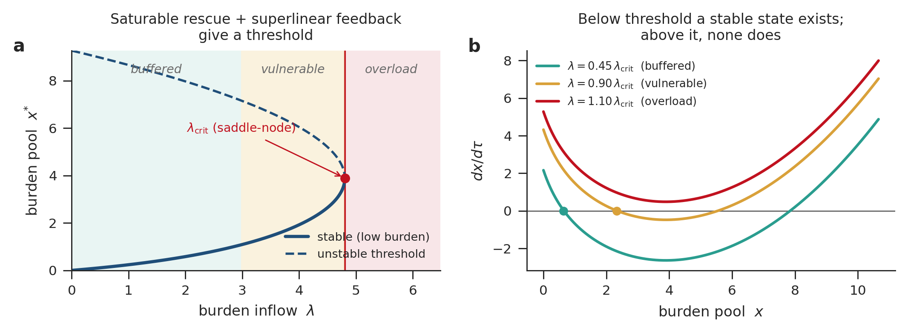
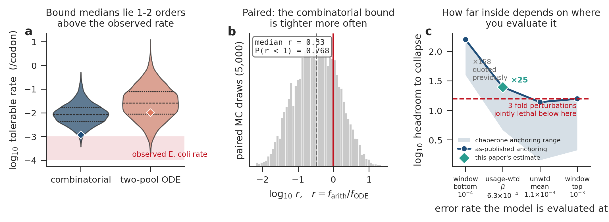
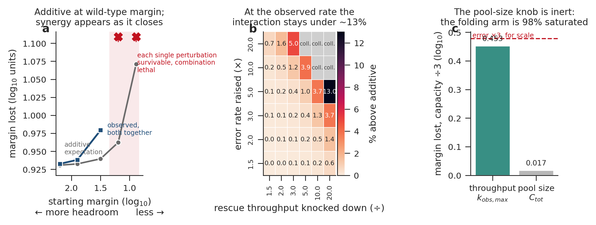
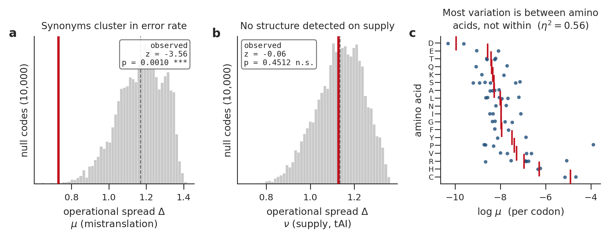

# A finite proteostasis envelope for translation

Hannah E. Rebbeck, Janak Paudyal, and Boggavarapu Kiran

Department of Chemistry and Physics, McNeese State University, Lake Charles, LA 70609, USA

Corresponding author: kiran@mcneese.edu

**Classification:** Biological Sciences / Systems Biology

**Keywords:** proteostasis | translation | mistranslation | protein aggregation | quality control

---

> **Status.** Canonical manuscript, assembled 2026-07-30 from
> `manuscript_v2_draft.md`. Every quantitative claim is regenerated by the
> scripts in `../scripts/` from the raw inputs in `../data/raw/` and asserted by
> `../tests/`. Limitations are stated inline at the claim each one bounds; there
> is deliberately no standalone Limitations section. Two analyses from an earlier
> draft were withdrawn on verification and are documented in `../README.md`,
> where a reader of the code will be — they are not discussed in this paper.
> Table placeholders below are filled from `../tables/TABLES.md` by
> `scripts/15_build_paper.py`, which emits the complete paper as `PAPER.md`,
> `PAPER.html`, `PAPER.pdf`, and `PAPER.docx`.

---

## Abstract

Translation is constrained not only by how much protein a cell makes but by the burden that making it imposes on proteome integrity. We develop the proposal that extant translation operates inside a finite proteostasis envelope: viability requires that the combined burden of decoding errors, folding failure, aggregation, and quality-control demand remain below the cell's buffering and clearance capacity, `B_total ≤ C_buffer`. We give the burden terms a flux-through-stages operationalization that avoids double-counting, and show that any reduced model combining saturable rescue with superlinear aggregation feedback possesses a saddle-node bifurcation, separating a buffered regime, a vulnerable regime, and an overload regime in which no bounded burden state exists. Two independent arguments then bound the maximum tolerable per-codon mistranslation rate: a combinatorial bound integrated over the *Escherichia coli* proteome, and a two-pool dynamical bound whose closure mechanism is aggregation death. In a paired Monte Carlo their medians differ by a factor of 3.1, with the combinatorial bound tighter in 76.8% of draws. Both sit one to two orders of magnitude above the observed *E. coli* rate. Evaluated at the usage-weighted mean error rate implied by our own mistranslation data (6.3 × 10⁻⁴ per codon), the two-pool system rests on its low-burden branch with ×25 headroom to collapse when the whole chaperone pool is available to damaged protein, and ×1.9 to ×25 once that availability is treated as the free parameter it is. That margin is small enough to matter. At it, a 3-fold rise in error rate combined with a 3-fold reduction in rescue throughput exceeds the additive expectation by 7.4%, and 12 of 36 tested perturbation pairs are survivable singly but lethal jointly, so the framework's distinguishing prediction is testable in wild-type *E. coli* without a sensitized background. Within that margin we also find that measured per-codon mistranslation is organized at the amino-acid level, with 56% of the variance in log μ between rather than within amino acids, while translational supply shows no comparable structure. We make no claim about the origin of the triplet code.

## Significance statement

Cells are usually described as limited by how fast they can make protein. They are also limited by what making it costs. Every synthesized chain risks a decoding error, a folding failure, or aggregation, and each of those consumes the same finite chaperone and degradation capacity. We treat these as coupled terms of one budget and show that any system combining saturable rescue with concentration-driven aggregation must have a collapse threshold rather than a graceful decline. Placing *E. coli* on that axis with two independent bounding arguments, we find it operates roughly one order of magnitude inside its own envelope. The margin is real but modest, and it is close enough to the edge that burden and capacity perturbations already compound: pairs of perturbations that each leave the cell viable are predicted to be lethal together, at strengths reachable in a standard laboratory cross. That prediction distinguishes this framework from any account in which the costs of translation add independently.

---

## Introduction

The central problem for an extant coding system is not symbolic mapping. It is operational control. Every translated protein imposes both output and burden: decoding errors create damaged products (1, 2), rapid synthesis competes with folding and rescue (3), misfolded species engage chaperones and degradation pathways (4, 5), and aggregated material amplifies further stress (6). These processes are not independent. An error can drive misfolding, misfolding can drive aggregation, and aggregation consumes the clearance capacity that would otherwise remove the earlier products (7). The load a cell carries therefore depends on its state, not only on which codons it is translating.

This coupling motivates a systems-level framing. We treat translation as operating within a finite proteostasis envelope: viability requires that the combined burden of decoding errors (`B_error`), folding failure (`B_fold`), aggregation (`B_agg`), and quality-control demand (`B_qc`) remain below the effective buffering and clearance capacity of the cell (`C_buffer`).

Existing frameworks each address one facet of this constraint. The translational robustness hypothesis connects mistranslation to misfolding, but treats it as a single axis of selection acting on individual coding sequences (8, 9). The proteostasis network concept describes the machinery that maintains proteome health and its decline with age, without formalizing translation as a multi-term burden source (7, 10, 11). Codon-usage analyses document synonymous effects, but model them as fixed properties of individual codons rather than as consequences that depend on cellular state (12). None of these makes a prediction about how perturbations at different stages of the burden cascade combine.

Two questions organize this paper. First, is the envelope real and finite, and where does extant translation sit inside it? Second, does that position have consequences an experiment can reach? We answer the first with two independent bounding arguments and the second with a factorial analysis of the dynamical model, which turns out to place *E. coli* just inside the regime where the framework's distinguishing prediction becomes a synthetic lethality rather than a small deviation from additivity. A bounded empirical observation about the organization of the genetic code follows, within the margin the first two questions establish.

One caveat belongs at the outset. Much synonymous codon usage is explained by mutation bias, genetic drift, and tRNA gene copy number rather than by selection on proteostatic effects (13). Nothing below requires a selective interpretation of codon usage, and we do not offer one.

---

## Theory

### The burden-capacity envelope

At coarse resolution the burden terms combine as

```
B_total = B_error + B_fold + B_agg + B_qc,      viability requires  B_total ≤ C_buffer
```

The additive form is a bookkeeping convenience, not a claim of independence. The terms form a causal cascade in which errors drive misfolding, misfolding drives aggregation, and aggregation consumes clearance capacity.

For the inequality to be testable rather than verbal, each term must map to an observable, and the mapping must avoid double-counting. We treat the terms as fluxes through stages rather than as disjoint pools (Table 1). `B_error` is the rate of production of mistranslated chains, the proteome-scale misincorporation frequency multiplied by synthesis flux. `B_fold` is the rate at which nascent or mature chains fail to reach the native state. `B_agg` is the rate of irreversible conversion of misfolded monomer into aggregate. `B_qc` is the demand these place on rescue and degradation machinery, measured as chaperone and protease occupancy. `C_buffer` is the finite throughput of the rescue and clearance network. Under this accounting a single misfolded protein is not counted three times: it contributes to `B_fold` when it fails to fold, to `B_agg` only if and when it aggregates, and to `B_qc` through the occupancy it imposes, each at its own stage. The decomposition is what makes the interaction prediction below meaningful, because independent terms would combine additively and coupled terms need not.

<!-- TABLE:Table 1 -->

### The collapse threshold

The dynamical statement, in nondimensional form, is

```
dx/dτ = λ − x − ρx/(1 + x) + χx²
```

where `x` is the effective burden pool, `λ` is burden inflow, `−x` is linear clearance, `−ρx/(1+x)` is saturable rescue, and `+χx²` is a minimal positive-feedback approximation to concentration-dependent aggregation. We write the rescue parameter as `ρ` to reserve `ν` for translational supply below.

Fixed points satisfy `λ = g(x)` with `g(x) = x + ρx/(1+x) − χx²`. Since `g'(x) = 1 + ρ/(1+x)² − 2χx` is positive at `x = 0` and negative for large `x` whenever `χ > 0`, `g` has exactly one interior maximum, and that maximum is a saddle-node bifurcation. Below it there are two fixed points, a stable low-burden node and an unstable upper threshold. At it they merge. Above it no bounded burden state remains (Fig. 1). The three regimes follow: buffered, with a stable low-burden state far from the threshold; vulnerable, stable but close enough that a perturbation carries the system past the unstable threshold; and overload, with no stable state. The transition is loss of the low-burden state rather than bistability, because `+χx²` dominates at large `x` and no second stable attractor exists in this model.

Two properties of the reduced model bound what it can be used for. Real aggregation kinetics are typically sigmoidal with a nucleation lag (14), so the quadratic term overstates early feedback and understates late-stage kinetics; it captures concentration dependence without kinetic detail. And the bifurcation establishes that a threshold exists, not where any organism sits relative to it. We do not fit `λ`, `ρ`, or `χ` to data. The quantitative content of this paper is in the two-pool analysis that follows.



**Fig. 1. The proteostasis envelope and its regimes.** (a) Fixed points of the reduced burden model, plotted as the inflow `λ = g(x)` required to hold the burden pool at `x`. Saturable rescue with superlinear feedback gives exactly one interior maximum of `g`, a saddle-node bifurcation at `λ_crit`: below it a stable low-burden branch (solid) and an unstable threshold (dashed) coexist, at it they merge, and above it no bounded state remains. Shaded bands mark the buffered, vulnerable, and overload regimes; the buffered-vulnerable boundary is illustrative. (b) `dx/dτ` against `x` at three inflow levels. Below threshold the curve crosses zero from above (filled circle, stable state); in overload it never reaches zero. The transition is loss of the low-burden state, not the appearance of a second stable state. Illustrative parameters (ρ = 4.0, χ = 0.15); not a fitted phase diagram.

---

## Results and Discussion

### Burden is measurable and buffering capacity is finite

The envelope's two premises are supported from different directions, and neither depends on the model above.

On the burden side, proteome-scale mass spectrometry gives per-codon misincorporation rates spanning 613-fold across the 61 sense codons, from 3.3 × 10⁻⁵ to 2.0 × 10⁻² per codon (1, 2). The span falls to 286-fold when the single highest codon, CCC, is excluded, so the order of magnitude rather than the exact ratio is the durable statement. Weighting the rates by *E. coli* codon usage gives a mean of 6.3 × 10⁻⁴ per codon. Over the *E. coli* proteome length distribution (UniProt UP000000625, n = 4,403; median 271 aa, mean 308 aa) that implies 16 to 18% of synthesized proteins carry at least one misincorporation, roughly one in six, treating errors at successive codons as independent. Local tRNA availability correlates errors along a transcript, so the independence assumption is an approximation, and the resulting figure should be read as a magnitude rather than a measurement.

Decoding burden connects to downstream proteotoxicity through documented routes. Mistranslation-inducing aminoglycoside treatment drives transient protein aggregation in *E. coli*, a direct link from `B_error` to `B_agg` (6), and elevated mistranslation engages the heat-shock buffering response (15). On the folding side, synonymous recoding impairs fitness by perturbing cotranslational folding and increasing degradation susceptibility (16), and synonymous changes direct the same amino acid sequence toward distinct folding outcomes (17, 18). The coupling runs through elongation timing: transient ribosomal attenuation coordinates synthesis with cotranslational folding (25), and codon-optimality signatures for cotranslational folding are conserved across yeasts (26). `B_fold` is therefore a burden component that protein output alone does not predict.

Capacity is where the evidence is strongest. Weakening the Hsp70-associated chaperone network amplifies the cost of protein production in yeast (4). Damaged nascent chains generate measurable cotranslational clearance demand (5, 19). Expanding chaperone capacity rescues otherwise insoluble overload in *E. coli* (20). Introducing a single metastable protein into *Caenorhabditis elegans* destabilizes pre-existing proteins, which indicates the network runs near capacity even unstressed (21). These results span bacteria, yeast, and nematode and are not numerically commensurate, so they support the structural claim rather than any shared parameter value: `C_buffer` is finite and load-bearing. They include no archaeal or mammalian system, so the envelope's generality rests on structural convergence rather than on molecular homology.

### Two independent bounds agree on where the envelope's edge lies

If the envelope is finite, its edge can be located. We bound the maximum tolerable per-codon mistranslation rate two ways, chosen because they share no logic.

The combinatorial bound asks what per-codon error rate would by itself drive the fraction of correctly folded protein below a viability threshold, taking per-codon error multiplied by protein length multiplied by misfolding probability, integrated over the *E. coli* proteome. At the reference parameter point (N = 300, P_correct = 0.7, p_misfold = 0.3, S_syn = 0.3) it gives 1.19 × 10⁻³ per codon. The two-pool bound is dynamical: a misfolded-monomer pool and an aggregated pool with saturable disaggregation, where the operational limit is set by the aggregated fraction reaching a lethal level. That mechanism, aggregation death rather than monomer runaway, sets the bound in 99.94% of Monte Carlo parameter draws. It gives 1.00 × 10⁻² per codon deterministically.

The two bounds share three parameters (protein length, misfolding probability, synonymous absorption), so comparing them requires a paired Monte Carlo in which both are computed from the same draw. Over 5,000 paired draws (Table 2, Fig. 3a,b) the combinatorial bound has median 8.35 × 10⁻³ per codon (95% CI 1.38 × 10⁻³ to 8.79 × 10⁻²) and the two-pool bound 2.59 × 10⁻² (95% CI 1.25 × 10⁻³ to 5.87 × 10⁻¹). Their medians differ by a factor of 3.1; the median of the paired ratio is 3.0; the combinatorial bound is tighter in 76.8% of draws, and the intervals overlap fully. Because the shared parameters are drawn once per sample, part of this agreement is imposed by construction, and the comparison should be read as a consistency check on the two closure mechanisms rather than as independent convergence. Agreement to within a factor of three between combinatorial accounting and aggregation dynamics is nonetheless the substantive result here; the point estimates are order-of-magnitude statements on literature-anchored parameters, not organism-fitted values.

<!-- TABLE:Table 2 -->

### *E. coli* operates about one order of magnitude inside the envelope

Both bounds lie above the observed *E. coli* mistranslation rate of roughly 10⁻⁴ to 10⁻³ per codon (1, 2). How far above depends on two choices, and the answer moves by more than an order of magnitude across them.

The first is where in the observed window to evaluate the model. The usage-weighted mean derived above, 6.3 × 10⁻⁴ per codon, is the evaluation point consistent with the rest of this analysis, because it is computed from the same per-codon rates that define the window. Evaluating at the bottom of the window instead inflates the headroom sixfold, from ×25 to ×158, which is the same class of error as quoting a Monte Carlo bound at its deterministic reference point rather than its median. Earlier drafts of this work quoted the ×158 figure. We use the usage-weighted value throughout and report the window as a sensitivity (Table 3, Fig. 3c).

The second choice is how much of the chaperone pool damaged proteins actually receive. At the operating point the model's folding arm is 97.4% saturated, with 37.6 µM free chaperone against 0.331 µM misfolded protein, a 113-fold excess. That is not a mis-set parameter: `C_tot` = 50 µM and `K_d` = 1 µM are both used within their sourced ranges (30 to 80 µM from GroEL and DnaK abundance; 0.06 to 2 µM from DnaK-substrate dissociation constants; Methods). It is structural. The rescue term gives the entire chaperone pool to the damaged-protein pool, because the model does not represent the ordinary nascent-chain folding load that occupies most chaperone capacity in a growing cell. `C_tot` in this model is therefore chaperone available to the damaged pool, and using the total silently assumes availability is complete.

We make that assumption explicit as a parameter, `C_avail = C_tot(1 − θ)`, with θ the fraction of the pool committed elsewhere, and sweep θ together with `C_tot` and `K_d` over their documented ranges (Table 3). θ is not measured here and nothing below estimates it. What the sweep gives is a decision threshold. The folding arm stops being saturated only above θ ≈ 0.98, and the viability margin falls to 1.19 log₁₀ at θ ≈ 0.90, which is the margin at which the interaction analysed in the next section changes character. Across the documented grid the headroom spans ×1.9 to ×25.

The defensible statement is that extant translation operates roughly one order of magnitude inside the envelope: about 1.4 orders (×25) at the usage-weighted evaluation point with full chaperone availability, and as little as ×1.9 once availability is varied over the documented ranges. A single measurement would collapse that range to a point, namely chaperone occupancy by nascent-chain folding in exponentially growing *E. coli*. The independent evidence that bears on it, Hsp70 buffering of production costs (4) and metastable-protein interference (21), both indicate limited spare capacity, which would place θ high and the margin near the lower end of this range. A model representing nascent-chain folding explicitly, rather than absorbing it into a free parameter, is the natural next refinement.

Either way the margin is small enough to have consequences. A cell operating at ×25, and possibly lower, sits near the edge of the regime in which burden-stage perturbations stop combining additively rather than deep in the linear interior.

<!-- TABLE:Table 3 -->



**Fig. 3. Where the observed error rate sits inside the envelope.** (a) Paired Monte Carlo distributions (5,000 draws) of the maximum tolerable per-codon error rate from the combinatorial and two-pool bounds; diamonds mark the deterministic reference points (1.19 × 10⁻³ and 1.00 × 10⁻²), internal lines mark quartiles, and the shaded band is the observed *E. coli* rate. (b) The paired ratio `r = f_arith/f_ODE`; the combinatorial bound is tighter in 76.8% of draws (median r = 0.33). Solid line, r = 1; dashed line, median. (c) Headroom to collapse as a function of where in the observed window the model is evaluated. Line, the θ = 0 chaperone anchoring; shaded band, the spread across six coarse anchorings, retained from an earlier version of the analysis and superseded by the θ sweep of Table 3; diamond, the usage-weighted mean error rate used throughout (×25 at θ = 0). The value quoted in earlier drafts (×158) is the leftmost point, at the bottom of the window. Dashed line, the margin below which a 3-fold error increase and a 3-fold rescue knockdown become jointly lethal. Order-of-magnitude arguments on literature-anchored parameters, not organism-fitted models.

### Burden and capacity perturbations interact supraadditively where *E. coli* sits

The framework's distinguishing claim is that perturbations at different burden stages interact supraadditively. Independent terms would combine additively; coupled terms need not. The claim is untested experimentally. It is testable in the model, and if the model came out additive the framework would be wrong on its own terms.

We ran a 2 × 2 factorial on the two-pool system, raising the per-codon error rate against knocking down rescue throughput, with the viability margin log₁₀(min(P†/P*, A_max/A*)) as the readout and the interaction defined as observed joint damage minus the additive expectation (Table 4, Fig. 4). The factorial is evaluated at the usage-weighted mean error rate established above, which is the operating point at which the question is meaningful.

The interaction is positive wherever it is defined and never subadditive, so the prediction is directionally confirmed. Its magnitude depends sharply on the starting margin, which is why the evaluation point governs the answer: the excess over additivity for a 3-fold error increase crossed with a 3-fold rescue knockdown is 0.2% at a margin of 2.20 log₁₀ — the window bottom, and the point earlier drafts evaluated at — rising to 0.6% at 1.90 and 7.4% at *E. coli*'s own margin of 1.39. The largest excess among combinations that remain viable is 9.6%, for a 2-fold error increase with a 5-fold knockdown (Table S4).

Below about 1.2 log₁₀ the result changes character. The combination has no stable state while each perturbation alone remains survivable (Fig. 4a). At *E. coli*'s operating point, 12 of the 36 perturbation combinations tested are already survivable alone and lethal together (Fig. 4b), the mildest being a 1.5-fold error increase with a 10-fold rescue knockdown; over a finer grid, 114 of 676 combinations are single-viable and jointly lethal. The prediction to test is therefore synthetic lethality in wild-type *E. coli*, not a small deviation from additivity, and it does not require a sensitized background.

Two properties bound this result. It tests whether the model predicts supraadditivity, not whether cells do, so it cannot validate the framework. And the two capacity knobs are not equivalent (Table S5): because the folding arm is 97.4% saturated, shrinking the chaperone pool `C_tot` costs only 0.022 log₁₀ of margin for a 3-fold cut, while cutting throughput `k_obs_max` acts proportionally and costs 0.460. The analysis above uses the throughput knob, which is what a chaperone mutant or an inhibitor of the ATPase cycle acts on. An experiment that reduced chaperone concentration alone would be testing the weaker of the two.

<!-- TABLE:Table 4 -->



**Fig. 4. Burden and capacity perturbations interact supraadditively at the observed operating point.** (a) Margin lost under both perturbations (error ×3, rescue throughput ÷3; blue squares) against the additive expectation (grey circles), as the starting margin is compressed from left to right. The two nearly coincide at wide margins and separate as the margin closes; the teal line marks *E. coli*'s own margin at the usage-weighted mean error rate (1.39 log₁₀), and earlier drafts evaluated this factorial off the left edge of the panel, at 2.20. In the shaded region each single perturbation is still survivable but the combination has no stable state, so the margin loss is unbounded; those points are marked with crosses at the top of the axis rather than assigned a value. (b) Interaction as a percentage of the additive expectation across the perturbation grid at the observed operating point. Cells marked **SL** are synthetic lethality — survivable alone, lethal together (12 of 36); cells marked 1× are already lethal from a single perturbation, and are shown separately because the two are different claims. (c) The two capacity knobs are not equivalent: shrinking the chaperone pool `C_tot` is nearly inert because the folding arm is 97.4% saturated, while cutting throughput `k_obs_max` acts proportionally. Dashed line, the error ×3 damage for scale. Parameters are the literature-anchored baseline; nothing is fitted.

### The measured error axis is organized at the amino-acid level; the supply axis is not

Within the margin established above, does the genetic code show operational structure of the kind this accounting would make relevant? We assigned each sense codon two coordinates: per-codon mistranslation rate μ from *E. coli* mass spectrometry (1), and translational supply ν from the tRNA adaptation index (23, 24). Per-codon μ at this resolution exists for no other organism, so everything in this section is established in *E. coli* alone. For each of the 18 multi-codon amino acids we computed the operational spread Δ_A, the mean pairwise distance among its synonyms in standardized coordinates, and compared the mean over amino acids against 10,000 permutation nulls (Methods). The full test grid, covering both axes, both null models, and both μ summary statistics, is in Table 5; per-codon coordinates are in Table S1 and per-amino-acid spreads in Table S2. Table 5 also lists the combined (μ, ν) space for completeness. We do not interpret it, because Δ in that space is a weighted mixture of a structured axis and an unstructured one, and its value moves with the mixing weights rather than with anything biological.

On the error axis, synonymous codons cluster far more tightly than either null (Fig. 2a): z = −3.56, p = 0.0010 against a within-degeneracy permutation, and z = −2.87, p = 0.0009 against a less constrained full shuffle. The result holds when μ is summarized by the per-codon median rather than the mean (z = −2.59, p = 0.0064), which matters because the underlying per-codon distributions are strongly right-skewed. Its descriptive form is a variance decomposition (Fig. 2c): 56% of the variance in log μ sits between amino acids rather than within them (η² = 0.556, F = 3.02, p = 0.0019, 59 codons in 18 amino acids). Synonyms of one amino acid are decoded with similar error rates; different amino acids differ substantially.

On the supply axis there is no comparable structure (Fig. 2b): z = −0.06 against the within-degeneracy null and z = +0.47 against the full shuffle, placing the observed spread within a twentieth of a standard deviation of the first null mean and half a standard deviation above the second. We do not attach evidential weight to the accompanying p-values, which are one-sided in whichever direction the statistic happened to fall and are therefore descriptive rather than evidential; in the hypothesized direction the full-shuffle value would be ≈0.68. The claim rests instead on what the test could have detected.

That question has to be answered, because the two axes are not equally well resolved. ν is derived from integer tRNA gene copy numbers and is heavily tied: only 21 of 59 codons carry distinct ν values, with the largest tied group spanning 13 codons, whereas all 59 log μ values are distinct. Coarse measurement attenuates real structure toward the null. To size the attenuation we shrank within-amino-acid deviations by a factor s and asked how weak a true clustering the permutation test still rejects (Table S6). On ν the test rejects once synonym spread is tightened by 35% (s ≤ 0.65; z = −1.94, p = 0.037), which places the detection floor 19.6% below its null mean. μ's observed clustering sits 37.4% below its null mean, 17.8 percentage points beyond that floor. An effect of μ's magnitude, present uniformly on ν, would have been detected.

The word uniformly carries weight. Under a harsher model in which clustering is confined to a random half of the amino acids, power reaches 0.53 at a 60% tightening and 0.75 at 80%, and does not reach 0.80 anywhere on our grid. The supportable claim is therefore narrower than a blanket absence: whatever organizes μ does not operate on ν uniformly across amino acids at a magnitude comparable to μ's. A ν effect confined to a subset of amino acids is not excluded by these data.

Two properties of the μ result bound its interpretation. It is not carried by a few codons. A leave-one-codon-out jackknife leaves the clustering significant in 59 of 59 deletions, with z between −3.86 and −2.62 (Table S7); dropping CCC, the 2.0 × 10⁻² maximum that sets the 613-fold span by itself and gives proline the largest Δ_A of any amino acid, leaves z = −3.67, marginally stronger than the full set. But the clustering cannot be separated from mass-spectrometry detectability. Per-codon μ is a mean over detected substitutions, and detection probability varies with amino acid through ionization efficiency, mass-shift resolvability, and peptide abundance, which would manufacture amino-acid-level structure with no biological content. The exposure is quantifiable and it is not small: per-codon sampling depth ranges from 1 to 16 detected substitutions (median 10), depth is inversely related to μ (Spearman ρ = −0.37, p = 0.004), and sampling depth carries as much amino-acid-level structure as μ itself, η² = 0.560 between amino acids for depth against 0.556 for log μ. The clustering survives dropping the most thinly sampled quartile of codons (z = −2.85, p = 0.007), so it is not an artifact of the sparsest measurements alone. It remains a property of the measured error landscape, whose amino-acid-level structure cannot be separated from amino-acid-level structure in detectability with these data. Resolving that requires per-codon error rates from a method whose detection probability does not vary with amino acid identity.

The contrast between the axes is the more durable observation. Whatever produces the μ structure, biological or instrumental, does not produce a counterpart on ν.

A further limit applies to both axes. The permutation null asks whether reassigning μ values across amino acids would loosen within-amino-acid spread, and if μ carries any amino-acid-level structure the answer is close to forced. There is a mechanistic reason to expect such structure independent of code organization: the substitutions reachable at a codon by near-cognate misreading are largely set by which amino acid it encodes, so synonyms share much of their error spectrum by biochemistry. The test establishes that the error axis is organized at the amino-acid level and quantifies how strongly. It does not establish that the code was selected to produce that organization, and we do not claim it was.

<!-- TABLE:Table 5 -->



**Fig. 2. The measured error axis is organized at the amino-acid level; the supply axis is not.** Observed operational spread Δ of synonymous codons (red line) against 10,000 within-degeneracy permutation nulls (grey; dashed line, null mean). (a) Error axis μ: synonyms cluster far more tightly than null (z = −3.56, p = 0.0010). (b) Supply axis ν: no comparable structure (z = −0.06); the test's detection floor on this axis is 19.6% below the null mean, against an observed μ effect of 37.4%. (c) Per-codon log μ by amino acid, ordered by amino-acid mean; red ticks mark amino-acid means. Most of the variation is between amino acids rather than within them (η² = 0.56).

---

## Discussion

The framework makes a single budget out of quantities usually studied separately, and thereby generates a prediction that none of them makes alone. Two arguments with different logic converge on a bound roughly one order of magnitude above where *E. coli* actually operates. That margin is the framework's most useful output, not because it is large but because it is small: at ×25, and as little as ×1.9 if the chaperone network is heavily committed to nascent-chain folding, *E. coli* sits inside the regime where burden-stage perturbations stop combining additively.

This extends rather than replaces earlier contributions. Drummond and Wilke established that mistranslation-induced misfolding constrains coding-sequence evolution at individual loci (8, 9); the constraint here is a feasibility condition on the translation apparatus as a whole. Balch and colleagues formalized proteostasis as a network property balancing synthesis, folding, trafficking, and degradation (10); the addition here is the decomposition of translation-derived burden into causally coupled stages, and the resulting regime structure. What none of these frameworks predicts is that perturbations at different stages should combine worse than additively at a cell's actual operating point. That is the claim to test.

The framework says nothing about why the code is a triplet code or why degeneracy exists. The observation above requires within-amino-acid synonymy to exist but says nothing about why it does. We make no code-origin claim.

### Predictions

**1. Synthetic lethality in wild type.** Combining a burden-raising perturbation with a reduction in rescue throughput should produce fitness defects worse than the sum of each alone, and at sufficient strength should be lethal where each perturbation alone is not. The experiment is a mistranslation-raising perturbation, a ribosomal ambiguity mutation or a sub-inhibitory aminoglycoside, crossed with a chaperone knockdown that reduces throughput rather than concentration, scored for synthetic lethality. The model places the mildest lethal combination at a 1.5-fold error increase with a 10-fold rescue knockdown, both within routine range, so no sensitization is required.

**2. Effects should scale with margin closed, not with perturbation size.** Because the interaction strengthens sharply as the margin closes, interventions that compress it should produce disproportionate effects: chaperone knockdown, heat stress, ageing (11), forced overexpression, or the supersaturated subproteomes implicated in aggregation disease (22).

**3. Synonymous effects should be condition-dependent.** The same codon-level perturbation should be mild in a buffered state and costly in a stressed one. This is observed in *E. coli*, where thousands of synonymous edits have substantially larger fitness effects in acetate than in glucose (27), with some of that effect flowing through folding and downstream handling (16). Carbon-source shifts also alter tRNA charging and metabolic flux directly, so the observation is consistent with the envelope without being diagnostic of it.

**4. Joint proxies should outperform single variables.** Burden and capacity proxies measured in the same system should predict viability boundaries better than any single translational variable, whether codon adaptation index, expression level, or error rate, used alone.

Until the distinguishing prediction is tested this is a motivated constraint on extant translation rather than an established one. The margin analysis says where to look, and says that the experiment does not require a sensitized background.

---

## Materials and Methods

All analyses are reproduced by the scripts in `../scripts/`, run in numeric order, from the raw inputs in `../data/raw/`. Outputs are written to `../data/computed/` and asserted by `../tests/test_manuscript_numbers.py`.

### Codon operational coordinates

Per-codon mistranslation rates μ were taken from the *E. coli* sheet of the Landerer et al. supplementary dataset (`Data_S2_error_detection_rate.xlsx`), which reports proteome-scale amino acid misincorporation measured by mass spectrometry (1). The per-codon mean across detected substitutions is used as μ. Because those distributions are right-skewed (median mean-to-median ratio ≈ 4.9), the analysis is repeated with the per-codon median and both results are reported. Per-codon sampling depth, the number of detected substitutions contributing to each mean, is retained for the detectability analysis.

Translational supply ν is the tRNA adaptation index for *E. coli* K-12 (23, 24); it is a gene-copy-number proxy for supply, not a measured elongation rate or ribosome transit time. No supply vector is used without passing an objective test. Translational selection predicts that highly expressed genes shift synonymous usage toward well-served codons, so for a valid tAI the per-codon usage shift between ribosomal protein genes (rpl, rps, rpm) and all genes must be positively related to tAI. The accepted vector passes: the higher-tAI synonym gains usage in ribosomal genes in 15 of 18 amino acids (sign test p = 0.0038). A previously used vector fails the same test (12 of 18, p = 0.12) and is retained in `data/raw/` under an explicit name so that the test suite can assert its failure (Table S3).

### Operational spread and null models

Coordinates were standardized across the analysed codon set: `μ̃ = (log μ − mean log μ)/sd(log μ)` and `ν̃ = (ν − mean ν)/sd ν`. Log μ is used because raw μ spans three orders of magnitude and is right-skewed. Operational spread is the mean pairwise Euclidean distance among synonyms, `Δ_A = [1/C(n_A,2)] Σ_{j<k} d(c_j, c_k)`. Met and Trp are excluded as single-codon amino acids, leaving 59 codons in 18 amino acids.

Two null models were used, each with 10,000 permutations (seed 42). The within-degeneracy null permutes values only among codons whose amino acids have the same degeneracy, preserving both the number of codons per amino acid and the value pool within each degeneracy class. The full shuffle permutes values across all analysed codons, preserving only alphabet size. Axis-specific tests compute Δ on μ alone or ν alone. Empirical p-values are one-sided in the observed direction with a +1 correction, so p is never reported as zero; for the supply axis, where the direction is not fixed in advance, they are reported as descriptive rather than evidential. The between- and within-amino-acid partition of log μ is a one-way decomposition reported as η² = SS_between/SS_total with a one-way F test.

### Detectable-effect and power analysis

To size what each axis test could have detected, within-amino-acid deviations were shrunk toward the amino-acid mean by a factor s, with s = 1 the observed code and s = 0 making all synonyms identical, and the permutation test re-run at each s (2,000 permutations per point, confirmed at 10,000 at the selected point). The minimum detectable effect is the largest s still rejected at α = 0.05, expressed as the percentage by which Δ falls below its null mean, which makes the two axes comparable. Because Δ is a deterministic function of the code, a power calculation requires a stochastic effect model; we applied the shrinkage to a random subset of amino acids, each included with probability 0.5, and report the rejection rate over 40 replicates per point. This subset model is a stated assumption, not a measurement of tAI error, and the coarse replicate count is why we report where power fails to reach 0.80 rather than a point estimate of it.

### Jackknife and detectability

Each of the 59 codons was deleted in turn and the within-degeneracy test re-run with the remaining set restandardized. Detectability exposure was quantified as the between-amino-acid variance partition of per-codon sampling depth, computed identically to the partition of log μ, together with the Spearman correlation between depth and log μ and re-running the permutation test after removing codons below the 10th and 25th percentiles of depth.

### Reduced dynamical model

The nondimensionalized burden model was analysed for fixed points and saddle-node structure by locating the interior maximum of `g(x) = x + ρx/(1+x) − χx²` on a dense grid. Figure 1 uses ρ = 4.0, χ = 0.15, giving a fold at x = 3.89 and λ_crit = 4.80. These parameters are illustrative and not estimated from data; the analysis establishes the existence of buffered, vulnerable, and overload regimes, not organism-specific values.

### Bounds and the paired Monte Carlo

The combinatorial and two-pool bounds are as computed in the upstream `proteostasis-P1` analysis; the staged result files (`arithmetic_results.json`, `two_pool_results.json`, `paired_mc_results.json`) are the inputs used here. All two-bound comparisons use the paired Monte Carlo, in which the parameters shared by both bounds (protein length drawn from the empirical UniProt distribution, misfolding probability, synonymous absorption) are drawn once per sample and both bounds computed from that draw (5,000 draws, seed 17). Statistics derived from separately parameterized marginal runs are not comparable and are not used.

### Chaperone parameters and their provenance

The two-pool model's rescue parameters are literature anchors: `C_tot` 30 to 80 µM with baseline 50 µM (GroEL ≈ 30 µM in exponentially growing *E. coli*; DnaK 30 to 50 µM), `K_d` 0.06 to 2 µM with baseline 1 µM (DnaK-substrate peptide dissociation constants), and `k_obs_max` 3 × 10⁻³ to 8.4 × 10⁻² s⁻¹ with baseline 10⁻² s⁻¹ (DnaK R-state release). Because the model represents only the damaged-protein pool and not nascent-chain folding, `C_tot` is interpreted as chaperone available to that pool and scaled by an explicit availability factor, `C_avail = C_tot(1 − θ)`. θ is swept, not fitted, and is not estimated by this work.

### Headroom and the supraadditivity factorial

Headroom is reported across the error rate at which the model is evaluated and the chaperone availability θ. For each cell the collapse threshold is recomputed and the margin is log₁₀(min(P†/P*, A_max/A*)). The evaluation point used throughout is the usage-weighted mean error rate derived from the μ data.

The 2 × 2 factorial uses the two-pool model vendored unmodified at `scripts/vendor/two_pool_ode.py`. For each cell the collapse threshold P† is recomputed via the operational saddle-node, because both the operating point and the threshold move under a capacity knockdown and that shared dependence is the coupling under test; the stable-branch steady state (P*, A*) is then solved for the perturbed inflow and the margin taken from whichever pool binds. Damage is margin lost relative to the unperturbed cell, and the interaction is observed joint damage minus the sum of the single-perturbation damages. Where the combination has no stable state the margin loss is unbounded and no numeric interaction is computed; substituting the baseline margin as a lower bound produces spurious negative interactions whenever the two single damages already exceed it, so those cells are recorded as qualitative synthetic lethality instead. Capacity is perturbed through `k_obs_max`, with `C_tot` reported alongside because the folding arm is saturated in this parameterization (Table S5). The factorial is evaluated at the usage-weighted mean per-codon error rate, read at run time from the burden analysis rather than written into the script, so that it cannot drift from the value the burden analysis derives; the window-bottom value is retained only as a labelled comparison row.

### Data and code availability

Raw inputs, analysis scripts, computed outputs, figures, tables (`tables/`, as both TSV and formatted markdown), and the numeric test suite are in this repository. `scripts/run_all.py` regenerates all of it, assembles the paper, and then runs the tests. `TODO before submission`: assign a public deposition DOI and record it here.

---

## Supplementary tables

Table S1 (per-codon coordinates), S2 (operational spread per amino acid), S3 (validation of the ν axis), S4 (supraadditivity effect-size grid at the operating point), S5 (the two capacity knobs), S6 (what the axis tests could have detected), and S7 (leave-one-codon-out jackknife) are in `../tables/TABLES.md`, with full-precision TSVs alongside. The two excluded analyses and the retired anchoring grid are in the same file, under headings that mark them as not results of this paper.

---

## References

*All entries carry a PMID or PMC identifier. Every reference is cited in the text; the correspondence is checked by `tests/test_manuscript_numbers.py`.*

1. Landerer, C., Poehls, J. & Toth-Petroczy, A. Fitness effects of phenotypic mutations at proteome-scale reveal optimality of translation machinery. *Mol. Biol. Evol.* 41, 2024. PMC10939442.
2. Mordret, E. et al. Systematic detection of amino acid substitutions in proteomes reveals mechanistic basis of ribosome errors and selection for translation fidelity. *Mol. Cell* 75, 427–441, 2019. PMID 31353208.
3. Agashe, V. R. et al. Function of trigger factor and DnaK in multidomain protein folding: increase in yield at the expense of folding speed. *Cell* 117, 199–209, 2004. PMID 15084258.
4. Farkas, Z. et al. Hsp70-associated chaperones have a critical role in buffering protein production costs. *eLife* 7, e29845, 2018. PMID 29377792.
5. Turner, G. C. & Varshavsky, A. Detecting and measuring cotranslational protein degradation in vivo. *Science* 289, 2117–2120, 2000. PMID 11000112.
6. Ling, J. et al. Protein aggregation caused by aminoglycoside action is prevented by a hydrogen peroxide scavenger. *Mol. Cell* 48, 713–722, 2012. PMID 23122414.
7. Jayaraj, G. G., Hipp, M. S. & Hartl, F. U. Functional modules of the proteostasis network. *Cold Spring Harb. Perspect. Biol.* 12, a033951, 2020. PMID 30833457.
8. Drummond, D. A. & Wilke, C. O. Mistranslation-induced protein misfolding as a dominant constraint on coding-sequence evolution. *Cell* 134, 341–352, 2008. PMID 18662548.
9. Drummond, D. A. & Wilke, C. O. The evolutionary consequences of erroneous protein synthesis. *Nat. Rev. Genet.* 10, 715–724, 2009. PMID 19763154.
10. Balch, W. E., Morimoto, R. I., Dillin, A. & Kelly, J. W. Adapting proteostasis for disease intervention. *Science* 319, 916–919, 2008. PMID 18276881.
11. Hipp, M. S., Kasturi, P. & Hartl, F. U. The proteostasis network and its decline in ageing. *Nat. Rev. Mol. Cell Biol.* 20, 421–435, 2019. PMID 30733602.
12. Plotkin, J. B. & Kudla, G. Synonymous but not the same: the causes and consequences of codon bias. *Nat. Rev. Genet.* 12, 32–42, 2011. PMID 21102527.
13. Shah, P. & Gilchrist, M. A. Explaining complex codon usage patterns with selection for translational efficiency, mutation bias, and genetic drift. *Proc. Natl. Acad. Sci. USA* 108, 10231–10236, 2011. PMID 21646514.
14. Burra, G. et al. Nucleation-dependent aggregation kinetics of yeast Sup35 fragment GNNQQNY. *J. Mol. Biol.* 433, 166732, 2020. PMID 33279578.
15. Evans, C. R. et al. Increased mistranslation protects E. coli from protein misfolding stress due to activation of a RpoS-dependent heat shock response. *FEBS Lett.* 593, 3220–3227, 2019. PMID 31419308.
16. Walsh, I. M. et al. Synonymous codon substitutions perturb cotranslational protein folding in vivo and impair cell fitness. *Proc. Natl. Acad. Sci. USA* 117, 3528–3534, 2020. PMID 32015130.
17. Buhr, F. et al. Synonymous codons direct cotranslational folding toward different protein conformations. *Mol. Cell* 61, 341–351, 2016. PMID 26849192.
18. Kimchi-Sarfaty, C. et al. A "silent" polymorphism in the MDR1 gene changes substrate specificity. *Science* 315, 525–528, 2006. PMID 17185560.
19. Filbeck, S., Cerullo, F., Pfeffer, S. & Joazeiro, C. A. P. Ribosome-associated quality-control mechanisms from bacteria to humans. *Mol. Cell* 82, 1451–1466, 2022. PMID 35452614.
20. de Marco, A. Protocol for preparing proteins with improved solubility by co-expressing with molecular chaperones in Escherichia coli. *Nat. Protoc.* 2, 2632–2639, 2007. PMID 17948006.
21. Gidalevitz, T. et al. Progressive disruption of cellular protein folding in models of polyglutamine diseases. *Science* 311, 1471–1474, 2006. PMID 16469881.
22. Ciryam, P. et al. Supersaturation is a major driving force for protein aggregation in neurodegenerative diseases. *Trends Pharmacol. Sci.* 36, 72–77, 2015. PMID 25636813.
23. dos Reis, M., Savva, R. & Wernisch, L. Solving the riddle of codon usage preferences: a test for translational selection. *Nucleic Acids Res.* 32, 5036–5044, 2004. PMID 15448185.
24. Chan, P. P. & Lowe, T. M. GtRNAdb 2.0: an expanded database of transfer RNA genes. *Nucleic Acids Res.* 44, D184–D189, 2016. PMID 26673694.
25. Zhang, G., Hubalewska, M. & Ignatova, Z. Transient ribosomal attenuation coordinates protein synthesis and cotranslational folding. *Nat. Struct. Mol. Biol.* 16, 274–280, 2009. PMID 19198590.
26. Pechmann, S. & Frydman, J. Evolutionary conservation of codon optimality reveals hidden signatures of cotranslational folding. *Nat. Struct. Mol. Biol.* 20, 237–243, 2013. PMID 23262490.
27. Yang, J. et al. Synonymous edits in the Escherichia coli genome have substantial and condition-dependent effects on fitness. *Proc. Natl. Acad. Sci. USA* 121, e2316834121, 2024. PMID 38252823.
